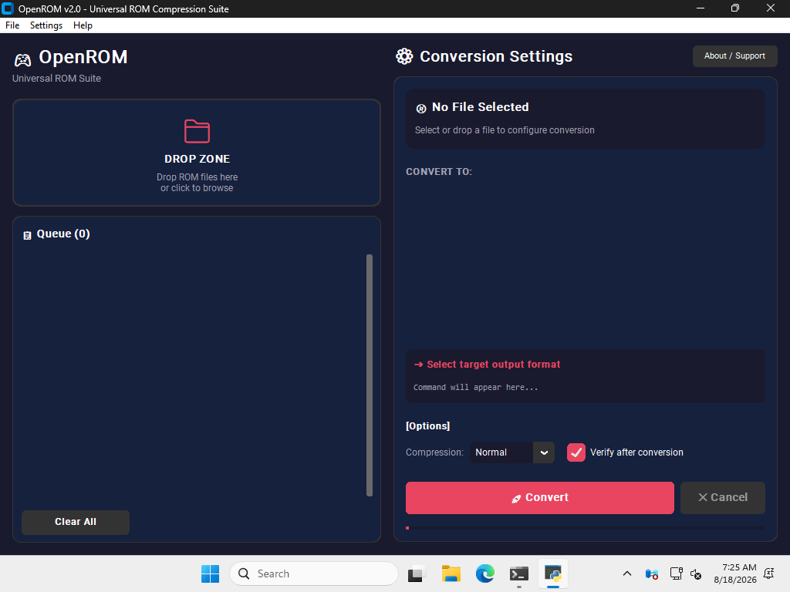

# ⬡ OpenROM v2.0

**Universal ROM Compression Suite** — by M5 Dev

[](LICENSE)
[]()
[](https://github.com/M5Devs/OpenROM/releases/latest)
[](https://github.com/M5Devs/OpenROM/releases/latest)

OpenROM is a Universal ROM Compression Suite built to break the monopoly of proprietary ROM tools. It features a modern two-column UI design, real-time command line terminal logging, batch processing, and direct single-click conversions.



---

## ⬇️ Download

| Platform | Download |
|----------|----------|
| 🪟 Windows | [OpenROM_Windows_Portable.zip](https://github.com/M5Devs/OpenROM/releases/latest) |
| 🐧 Linux | [OpenROM_Linux_x86_64.AppImage](https://github.com/M5Devs/OpenROM/releases/latest) |
| 🍎 macOS Apple Silicon | [OpenROM_macOS_arm64.dmg](https://github.com/M5Devs/OpenROM/releases/latest) |
| 🍎 macOS Intel | [OpenROM_macOS_x86_64.dmg](https://github.com/M5Devs/OpenROM/releases/latest) |

---

## 🎮 Features

- **Modern Two-Column Design** — Clean split interface with DROP ZONE & Queue on the left, and Conversion Settings / Controls on the right.
- **Complete Conversion Matrix** — Support for over 15+ conversion paths including ISO, BIN, CUE, GDI, IMG, ECM, CHD, CSO, ZSO, and XISO.
- **Live Terminal & Logging** — Real-time process logging saved to your OS config directory.
- **Auto CUE Generation** — Auto-generates CUE files for standalone BIN files missing CUE sheets.
- **Auto ECM Output Format** — Auto-detects extracted format (ISO/BIN) after ECM decompression.
- **Integrity Verification** — Automatic post-conversion integrity check for CHD files via `chdman verify`.
- **Drag & Drop** — Native drag and drop support for single files and batch folders.

---

## 🔁 Complete Conversion Matrix

| Input Format | Output Target | Tool Used | Command Executed |
|--------------|---------------|-----------|------------------|
| ISO | CHD | chdman | `createdvd -i in -o out` |
| ISO | CSO | maxcso | `maxcso in -o out` |
| ISO | ECM | ecm | `ecm in out` |
| ISO | XISO | extract-xiso | `-r in` |
| BIN | CHD | chdman | `createcd -i cue -o out` *(Auto CUE if missing)* |
| BIN | ECM | ecm | `ecm in out` |
| CUE | CHD | chdman | `createcd -i in -o out` |
| GDI | CHD | chdman | `createcd -i in -o out` |
| IMG | CHD | chdman | `createdvd -i in -o out` |
| CHD | ISO | chdman | `extractdvd -i in -o out` |
| CHD | BIN/CUE | chdman | `extractcd -i in -o out.cue` |
| CSO | ISO | maxcso | `--decompress in -o out` |
| ZSO | ISO | maxcso | `--decompress in -o out` |
| ECM | ISO / BIN | unecm | `unecm in out` *(Auto-detects output format)* |
| XISO | ISO | extract-xiso | `-x in -d out` |

---

## 🛠️ Tools Bundled

| Tool | Purpose |
|------|---------|
| **chdman** | MAME CHD conversion tool |
| **maxcso** | PSP/PS2 CSO/ZSO compression |
| **ecm / unecm** | Error Code Modulator compression |
| **extract-xiso** | Xbox ISO extraction & creation |

All tools are bundled for Windows and Linux. No additional setup required.

---

## 🚀 Building & Running

### Requirements
- Python 3.10+
- Dependencies in `requirements.txt`

### Running from Source
```bash
git clone https://github.com/M5Devs/OpenROM
cd OpenROM
pip install -r requirements.txt
python main.py
```

### Building
```bash
# Windows
build.bat

# Linux
chmod +x build.sh && ./build.sh

# macOS
chmod +x build_mac.sh && ./build_mac.sh
```

---

## 🤝 Contributing

Contributions are welcome! Please read [CONTRIBUTING.md](CONTRIBUTING.md) for guidelines on how to submit bug reports, feature requests, and pull requests.

---

## 📄 License & Support

OpenROM is licensed under **GPL v3**.

### 💙 Support OpenROM
If OpenROM saved you time, consider supporting active development:

Donate USDT (TRC20):
`TWbG9smLbcyTcVod3YsRPyEtWhtQnnu7vC`
